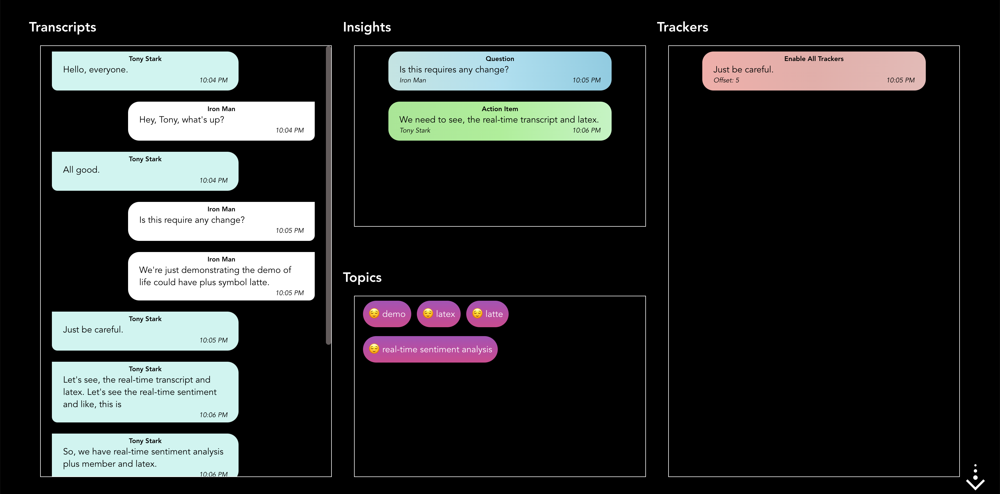
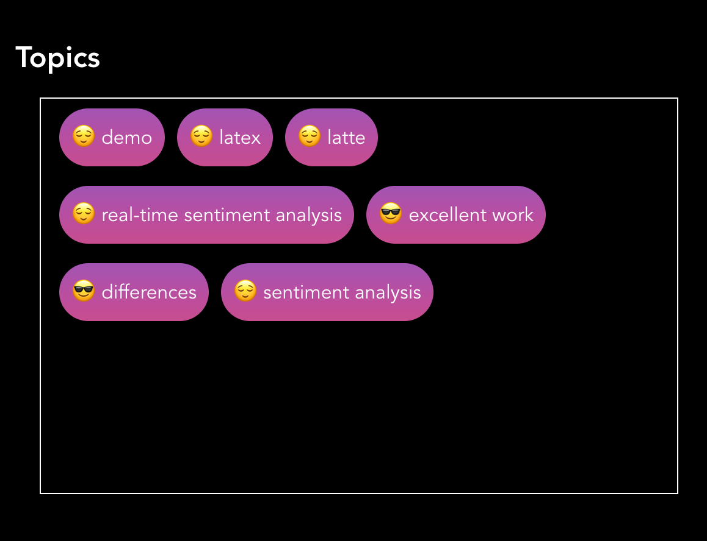
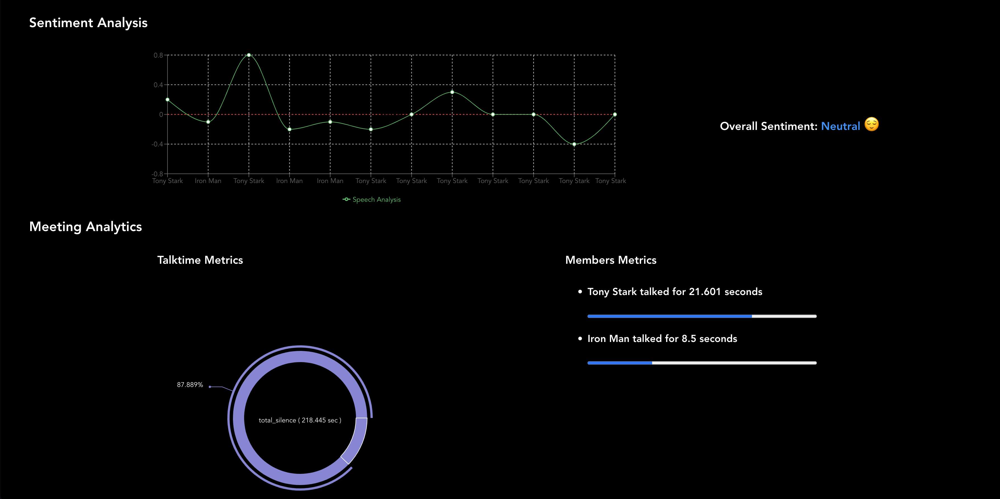
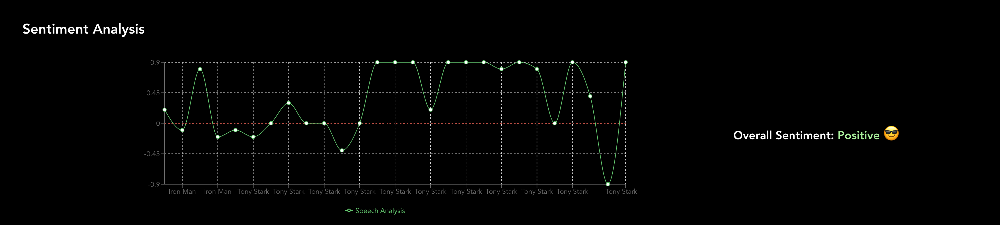

# Symbl LiveKit RTC App

[![Websocket][symbl_websocket_bright_green_badge]][symbl_streaming_api_docs]


Symbl's APIs empower developers to enable:
- **Real-time** analysis of free-flowing discussions to automatically surface highly relevant summary discussion topics, contextual insights, suggestive action items, follow-ups, decisions, and questions.
- **Voice APIs** that makes it easy to add AI-powered conversational intelligence to either [telephony][telephony] or [WebSocket][symbl_streaming_api_docs] interfaces.
- **Conversation APIs** that provides a REST interface for managing and processing your conversation data.
- **Summary UI** with a fully customizable and editable reference experience that indexes a searchable transcript and shows generated actionable insights, topics, timecodes, and speaker information.

**This app is provided for demonstration purposes only. Please feel free to report any issue in the `Issues` section.**

<hr />


## Table of Contents
- [Introduction](#introduction)
- [Features](#features)
- [Pre-requisites](#pre-requisites)
- [Installation](#installation)
    - [Setup](#setup)
    - [Run Locally](#run-locally)
- [Usage](#usage)
- [Screenshots](#screenshots)
- [Community](#community)
- [License](#license)

## Introduction
This is a multi-party video-conferencing application that demonstrates [Symbl's Real-time APIs][symbl_streaming_api_docs]. This application is inspired by [LiveKit's video app][livekit_example_react_app] and is built using [LiveKit's React SDK][livekit_react_sdk] and [Create React App][create_react_app_link].

## Features
This extension provides the following out-of-the-box conversational intelligence features:

- **Live Closed Captioning**: Live closed captioning is enabled by default and provides a real-time transcription of your audio content.
- **Real-time Transcription**: Symbl offers state-of-the-art Speech-to-Text capability (also called transcription). You can get audio and video conversations transcriptions in real-time.
- **Real-time Insights**: Symbl allows you to get the real-time insights (action items, questions and follow ups) of the conversations.
- **Real-time Topics with sentiments**: Symbl allows you to get the real-time topics of the conversations along with their sentiments.
- **Real-time Trackers detection**: Symbl allows real-time detection of the trackers in the conversation. 
- **Real-time Sentiment Analysis of the conversations**: Symbl allows you to get real-time sentiment analysis (sentence level) and aggregated/overall sentiment categorisation of the conversations.
- **Real-time Meeting metrics**: Symbl allows you to get real-time analytics of `total talktime`, `total silence` and `total overlapping time` of the meeting.
- **Real-time Member metrics**: Demonstrates the `talktime` or contribution of a member in the conversations.
- **Video conferencing with real-time video and audio**: This allows you to use this for real-time use cases where both the video, audio, and its results from Symbl's back-end need to be available in real-time. It can be integrated directly via the browser or server.
- **Enable/Disable camera**: After connecting your camera you can enable or disable the camera when you want.
- **Mute/unmute mic**: After you connect to your device's microphone you can mute or unmute when you want.
- **Screen sharing**: This can be used to capture the screen directly from the web app.
## Pre-requisites

- [Node JS (version 14+)](node_js_download_link)
- [Symbl Account][symbl_signup]

## Installation

### Setup

1. Clone the project

    ```bash
    git clone https://github.com/SymblDev/symbl-livekit-rtc-app.git
    ```

2. Go to the project directory

    ```bash
    cd symbl-livekit-rtc-app
    ```

3. Install dependencies

    ```bash
    npm install
    ```

### Run Locally
1. Navigate to the `src/symbl/config/` directory and open the `config.js` file.
2. Add your Symbl `App Id` and `App Secret` values in the respective fields below:

    ```javascript
   appId: '',
   appSecret: ''
   ```

3. Modify the rest of the configuration such as Trackers, Sentiment Analytics as per requirements. [Optional]

    ```javascript
    realtimeSentimentAnalysis: true,
    realtimeAnalyticsMetric: true,
    trackers: [
      {
        name: "Promotion Mention",
        vocabulary: [
         "We have a special promotion going on if you book this before",
         "I can offer you a discount of 10 20 percent you being a new customer for us",
         "We have our month special this month",
         "We have a sale right now on"
        ]
      }
    ]
    ```

4. Start the application.
    ```npm
    npm start
    ```
The application will be started at [http://localhost:3000](http://localhost:3000)

## Usage
1. Navigate to [http://localhost:3000](http://localhost:3000)

2. Enter the LiveKit URL
    > If the LiveKit server is not running at the localhost, we can utilize the LiveKit's playground server URL.
    > ```text
    >    wss://demo.livekit.cloud
    > ```

3. Enter the `Token` generated using the LivekKit's Server.
    > If the LiveKit server is not running at the localhost, we can utilize the LiveKit's playground server URL to generate token.
    > ```
    >    curl --location --request POST 'https://livekit.io/api/playground/tokens' \
    >    --header 'authority: livekit.io' \
    >    --header 'Content-Type: text/plain;charset=UTF-8' \
    >    --data-raw '{
    >        "roomName": "tower",
    >        "userName": "Stark"
    >    }'
    > ```

4. Click on `Connect` to enter the Room.

5. Closed Captioning will appear on the screen as soon as a person start speaking.

6. To view the Symbl Results (Transcripts, Insights, Topics, Trackers), click on the down arrow that appear in bottom right corner as soon as Symbl's intelligence is generated.
<br><br>

    > ### Adding Multiple Participants in a Room
    >
    > If you want to see how the application behaves with multiple participants, you can simply open `localhost:3000` in multiple tabs in your browser and connect to the same room using different user names.
    >
    >Additionally, if you would like to invite other participants to a room, each participant would need to have their own installation of this application and use the same room name and Account SID (the API Key and Secret can be different).

## Screenshots

- Live Closed Captioning
  >  

- Real-time Transcripts, Insights (Action Items, Questions and Follow Ups), Topics and Trackers 
  >  

- Real-time Topics with sentiments
  >  

- Sentiment and Meeting Analytics
  >  

- Sentiment Analysis with overall sentiment
  >  

## Community

If you have any questions, feel free to reach out to us at `devrelations@symbl.ai` or through our [Community Slack][slack] or our [forum][developer_community].

This guide is actively developed, and we love to hear from you! Please feel free to [create an issue][issues] or [open a pull request][pulls] with your questions, comments, suggestions, and feedback. If you liked our integration guide, please star our repo!

## License

This library is released under the [MIT][license]

[license]: LICENSE.txt
[symbl_websocket_bright_green_badge]: https://img.shields.io/badge/symbl-websocket-brightgreen
[telephony]: https://docs.symbl.ai/docs/telephony/overview/post-api
[symbl_streaming_api_docs]: https://docs.symbl.ai/docs/streamingapi/overview/introduction
[developer_community]: https://community.symbl.ai/?_ga=2.134156042.526040298.1609788827-1505817196.1609788827
[slack]: https://join.slack.com/t/symbldotai/shared_invite/zt-4sic2s11-D3x496pll8UHSJ89cm78CA
[issues]: https://github.com/SymblDev/symbl-livekit-rtc-app/issues
[pulls]: https://github.com/SymblDev/symbl-livekit-rtc-app/pulls
[node_js_download_link]: https://nodejs.org/en/download/
[symbl_signup]: https://platform.symbl.ai/#/signup?utm_source=get-info&utm_medium=marcelo&utm_campaign=rep
[livekit_example_react_app]: https://github.com/livekit/livekit-react/tree/master/example
[livekit_react_sdk]: https://github.com/livekit/livekit-react
[create_react_app_link]: https://github.com/facebook/create-react-app